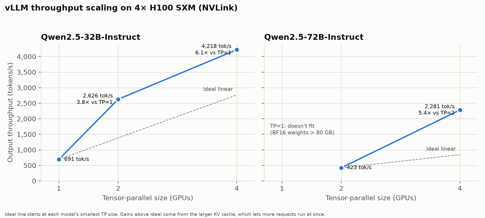
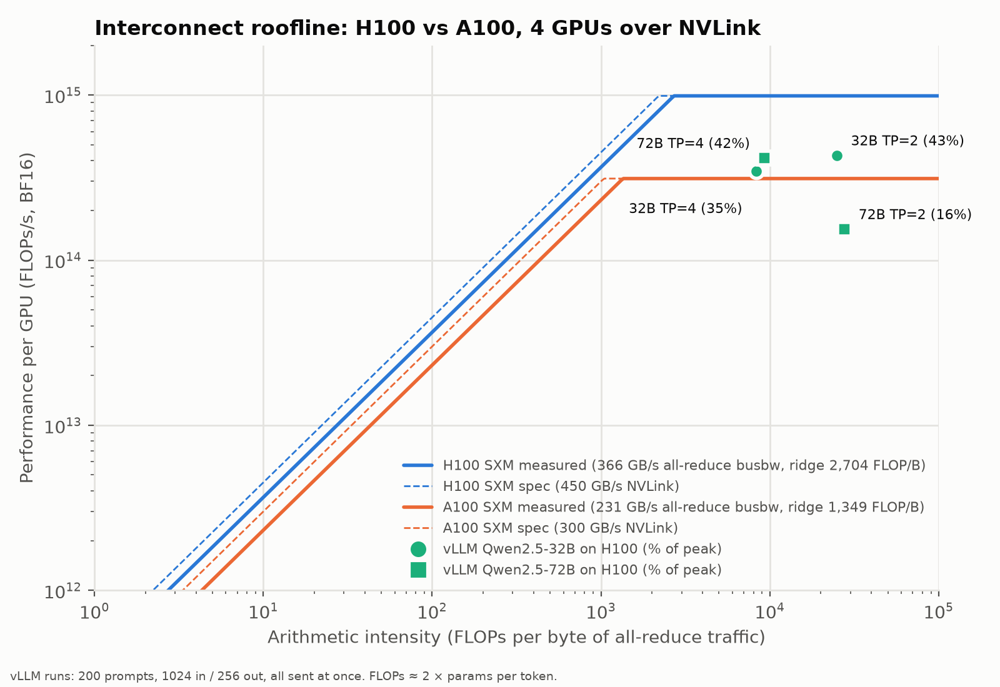
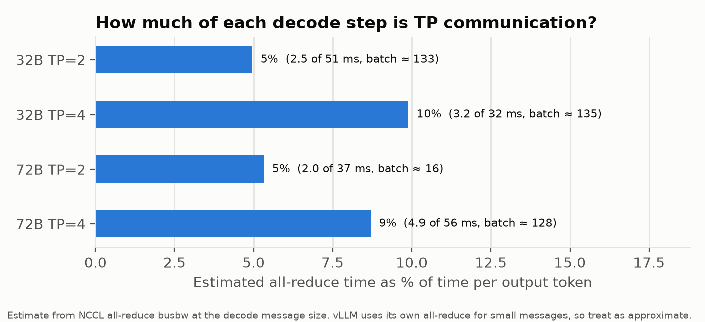

# Multi-GPU LLM Inference Scaling & Roofline Analysis

How far does LLM inference throughput scale when a model is split across GPUs with tensor parallelism, and what limits it? This project measures the interconnect directly (NCCL collectives and point-to-point copies on 4× A100 and 4× H100 over NVLink), builds an interconnect roofline from those measurements, then serves Qwen2.5-32B and Qwen2.5-72B with vLLM at tensor-parallel sizes 1, 2 and 4 to see how the application-level result lines up with the hardware.

**Finding:** on 4× H100 SXM, throughput scaled *better* than linearly (Qwen2.5-32B: 6.1× from 1 to 4 GPUs), because each added GPU frees memory for KV cache and lets more requests run at once. TP all-reduce is an estimated 5–10% of each decode step. It roughly doubles from TP=2 to TP=4, but it isn't the bottleneck at this scale. At the message sizes inference actually sends (about 0.25–2 MB), NCCL reaches only 21–103 GB/s of the 366 GB/s it achieves on large messages. That makes communication cost a latency problem, not a bandwidth one.



## Motivation

Adding GPUs to an inference deployment only pays off if the extra compute isn't eaten by communication between them. Tensor parallelism all-reduces activations twice per transformer layer for every token, so the interconnect sits directly on the critical path of every decode step. Measuring where the time actually goes, rather than assuming "NVLink is fast enough", tells you how much of your GPU spend you're actually getting to use.

## Setup

| | A100 run | H100 run |
|---|---|---|
| GPUs | 4× NVIDIA A100-SXM4-80GB | 4× NVIDIA H100 80GB HBM3 (SXM) |
| Interconnect | NVLink 3, every pair connected (NV12) | NVLink 4, every pair connected (NV18) |
| Provider | RunPod | RunPod (4 GPUs of an 8-GPU HGX board) |
| Driver / CUDA | 580.126.16 / CUDA 12.8 runtime | 580.126.09 / CUDA 12.8 runtime |

Software: nccl-tests 2.20.0 with NCCL 2.25.1 (H100 run), nvbandwidth v0.10.0, vLLM 0.30.0 (bundling NCCL 2.29.7) with PyTorch 2.13.0. Models are Qwen2.5-32B-Instruct and Qwen2.5-72B-Instruct in BF16.

## Methodology

1. **Collective bandwidth** (`nccl_bench/run_nccl_sweep.py`): `all_reduce`, `all_gather`, `broadcast` and `alltoall` from nccl-tests, on 1–4 GPUs, at message sizes from 8 B to 8 GB (×2 steps). The script records bus bandwidth (`busbw`), which NCCL normalizes so it can be compared with link bandwidth.
2. **Point-to-point bandwidth**: `nvbandwidth`, which gives every GPU-to-GPU and host-to-GPU copy rate.
3. **Roofline** (`analysis/plot_roofline.py`): BF16 peak compute against the interconnect bandwidth ceiling, using both the vendor spec and the measured all-reduce busbw. Each vLLM run is placed on it:
   - x = FLOPs per byte of TP all-reduce traffic per GPU
   - y = achieved FLOPs/s per GPU, taking ≈ 2 × params FLOPs per token
4. **Inference benchmark** (`inference_bench/run_vllm_sweep.sh`): for each model and TP size, the script starts `vllm serve` (`--max-model-len 8192 --gpu-memory-utilization 0.95`), then runs `vllm bench serve`. Every run uses the same workload: 200 random prompts, 1024 input and 256 output tokens, seed 0, all sent at once (request rate `inf`), so throughput reflects capacity.
5. **Communication share** (`analysis/comm_share.py`): estimates the time each decode step spends in all-reduce.
   - Batch size, from Little's law: sequences in flight ≈ output tokens/s × time per output token.
   - Message size = batch × hidden size × 2 bytes.
   - All-reduce time comes from the measured NCCL busbw at that size: 2 all-reduces per layer, compared with the measured TPOT.

## Results

### Interconnect

Peak bus bandwidth at 4 GPUs (GB/s):

| Collective | A100 (NVLink 3) | H100 (NVLink 4) | H100 / A100 |
|---|---|---|---|
| all_reduce | 231 | 366 | 1.58× |
| broadcast | 232 | 365 | 1.57× |
| alltoall | 223 | 356 | 1.60× |
| all_gather | 204 | 348 | 1.71× |

All-reduce reaches 77% (A100) and 81% (H100) of the per-direction NVLink spec (300 / 450 GB/s). Point-to-point copies get closer to spec: nvbandwidth measured about 278 GB/s per GPU pair on A100 (93% of spec) and about 395 GB/s on H100 (88%). Host-to-GPU copies were 26 vs 55 GB/s per GPU, which reflects PCIe Gen4 vs Gen5.

Small messages are far from peak. On the H100, 4-GPU all-reduce reaches 5 GB/s at 64 KB, 73 GB/s at 1 MB, 249 GB/s at 16 MB and 340 GB/s at 256 MB.

### Roofline



The measured ridge point is 2,704 FLOP/B on H100 and 1,349 FLOP/B on A100. TP inference sits well to the right of it, at 8,300–27,700 FLOPs per byte of all-reduce traffic. The bandwidth slope never binds, and the runs reach 16–43% of H100 BF16 peak. Whatever limits them, it isn't interconnect bandwidth.

### Inference scaling (4× H100)

| Model | TP | Output tok/s | Speedup | Median TTFT | Median TPOT | KV cache (tokens) |
|---|---|---|---|---|---|---|
| Qwen2.5-32B | 1 | 691 | 1.0× | 34.5 s | 35.6 ms | 35,536 |
| Qwen2.5-32B | 2 | 2,626 | 3.8× | 6.4 s | 50.4 ms | 334,880 |
| Qwen2.5-32B | 4 | 4,218 | 6.1× | 3.7 s | 32.2 ms | 928,224 |
| Qwen2.5-72B | 2 | 423 | 1.0× | 53.4 s | 33.9 ms | 20,432 |
| Qwen2.5-72B | 4 | 2,281 | 5.4× | 7.9 s | 55.7 ms | 498,416 |

Qwen2.5-72B can't run at TP=1, because its BF16 weights (about 135 GiB) exceed one GPU's 80 GB. TTFT includes queueing time, since all 200 requests arrive at once.

### Communication share of each decode step



| Run | Est. batch | All-reduce message | NCCL busbw at that size | Comm time / TPOT |
|---|---|---|---|---|
| 32B TP=2 | 133 | 1.3 MB | 69 GB/s | 2.5 / 51 ms (5%) |
| 32B TP=4 | 135 | 1.3 MB | 84 GB/s | 3.2 / 32 ms (10%) |
| 72B TP=2 | 16 | 250 KB | 21 GB/s | 2.0 / 37 ms (5%) |
| 72B TP=4 | 128 | 2.0 MB | 103 GB/s | 4.9 / 56 ms (9%) |

## Discussion

**Scaling here is governed by memory capacity, not the interconnect.** With all requests arriving at once, the number of requests a configuration can run in parallel is set by how much KV cache fits after the weights are loaded:

- **Qwen2.5-32B:** at TP=1 the weights take most of one GPU, leaving room for about 35k tokens of KV cache, roughly 4 full-length requests. At TP=4, each GPU holds a quarter of the weights and the cache grows 26× to 928k tokens.
- **Qwen2.5-72B:** the cache grows 24× from TP=2 to TP=4. The Little's-law batch estimate goes from about 16 to 128, which matches: 20k tokens ÷ 1,280 tokens per request ≈ 16.

More requests in flight means more work per weight read, which is why speedups exceed the GPU count.

**Communication is a growing cost, not yet the bottleneck.** Going from TP=2 to TP=4 roughly doubles the share of each step spent in all-reduce (5% → 9–10%). Each GPU computes half as much per token, while all-reduce traffic per GPU rises from 1.0× to 1.5× the message size, and small messages run at a fraction of peak busbw. The roofline makes this concrete: TP inference has plenty of arithmetic intensity relative to the link, but at 0.25–2 MB per message, NCCL operates in its latency-dominated regime. This is the cost that would dominate at TP=8 or across nodes.

## Limitations

- **Single node, at most 4 GPUs, one model family.** I didn't test TP=8 or multi-node scaling.
- **NVLS (NVLink SHARP) was disabled** (`NCCL_NVLS_ENABLE=0`). On the RunPod 4-GPU slice of an 8-GPU board, NVLS multicast fails with `CUDA_ERROR_ILLEGAL_STATE` at 3+ GPUs. H100 collective results are therefore without NVLS and likely below what a full board achieves.
- **One run per configuration,** so there are no error bars.
- **The communication share is an estimate.** The batch size comes from Little's law, and vLLM uses its own custom all-reduce for small messages rather than NCCL, so NCCL busbw is a proxy for its cost. Chunked prefill also mixes prefill tokens into decode steps.
- **The FLOP counts ignore attention** (small at about 1.3k tokens of context). The roofline's y-axis is approximate.
- **Throughput is measured with all requests sent at once,** which mixes the effect of memory capacity with communication cost.

## What's next

- **Tensor vs pipeline parallelism** at 4 GPUs, plus fixed-concurrency runs (`--max-concurrency`) that remove the KV-cache effect and isolate communication cost.
- **PCIe-only vs NVLink** on the same sweep, to show how much of the scaling the fabric buys.
- **AMD (RCCL / ROCm)** with the same harness.
- **FP8 weights,** which halve memory per parameter and so shift both the KV-cache headroom and the roofline position.

## Reproducing

On the GPU host:

```bash
# NCCL collectives (after building nccl-tests with `make MPI=0`)
NCCL_TESTS_BUILD=/path/to/nccl-tests/build python3 nccl_bench/run_nccl_sweep.py

# vLLM scaling sweep
export HF_HOME=/workspace/hf
MODEL=Qwen/Qwen2.5-32B-Instruct TPS="1 2 4" bash inference_bench/run_vllm_sweep.sh
```

Locally, from the collected results:

```bash
uv venv .venv && uv pip install --python .venv/bin/python -r requirements.txt
.venv/bin/python inference_bench/collect_bench.py results/h100_4gpu/vllm/sweep
.venv/bin/python analysis/plot_roofline.py
.venv/bin/python analysis/plot_scaling.py
.venv/bin/python analysis/comm_share.py
```

## Repository layout

```
nccl_bench/run_nccl_sweep.py       NCCL collective sweep → CSV of busbw per op / GPU count / size
inference_bench/run_vllm_sweep.sh  start vLLM per TP size, benchmark, shut down
inference_bench/collect_bench.py   vLLM result JSONs → one CSV
analysis/                          roofline, scaling and communication-share scripts
plots/                             generated figures
results/a100_4gpu, h100_4gpu       raw data: NCCL CSVs, nvbandwidth, topology, vLLM results and logs
```
